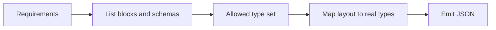

# Theme Builder — Shopify JSON templates (Online Store 2.0)

<!-- source: https://shopify.dev/docs/storefronts/themes/architecture -->
## When to use this skill

Use when the task involves **JSON templates** under `templates/` (e.g. `product.json`, `index.json`, alternates like `page.contact.json`, or customer JSON under `templates/customers/` if present), or **section JSON** that references **theme blocks** from `blocks/` in block-based themes.

**This skill alone does not fully cover:**

- `config/settings_schema.json` or `config/settings_data.json` (global theme settings)
- Checkout branding or Checkout UI extensions
- Theme app extension code under `extensions/`
- Replacing **Liquid** `.liquid` templates where the theme has not adopted JSON for that route

If the theme uses a **build step** that generates `sections/` or `blocks/`, read that theme’s README and follow its source-of-truth paths before editing compiled output.

## Quick start

1. **Understand requirements** — Parse prompts or images for layout, columns/rows, content types, and styling (see **Design images and mockups** when the input is visual).
2. **Discover allowed block types** — List `blocks/` and read parent `` so every `type` you use exists in this theme (required; see below).
3. **Map to real blocks** — Choose types only from that allowed set; resolve section `type` from `sections/*.liquid` for template-level JSON.
4. **Analyze schemas** — Read each block or section `` for allowed children, setting IDs, types, defaults, and presets.
5. **Compile JSON** — Build valid `sections`, nested `blocks`, and `order` / `block_order` arrays per Shopify’s template structure.
6. **Validate** — Run the checklist below before finishing.

## Bundled theme examples (optional)

This skill package may ship an **`examples/`** folder with **indexed** recipes keyed to specific themes or theme families. **SKILL.md does not embed any named theme’s block vocabulary**—that lives only in the matching file under `examples/`.

**When to use them:** After **Discover allowed block types**, follow **Choosing the best example to reference** in [examples/README.md](examples/README.md): compare the workspace theme to each indexed example (theme name, README, overlap between `blocks/` basenames and the example’s described types). Open **at most one** best-matched file, or **none** if nothing fits—then copy patterns from existing `templates/*.json` in the workspace theme.

**Never** emit `type` strings from a bundled example until they appear in the target theme’s allowed set.

## Workflow

### Step 1 — Understand user requirements

**From text:**

- Layout: grid, flex, slider, inline, etc.
- Column/row counts
- Content: images, buttons, text, product cards, etc.
- Styling: spacing, colors, responsive behavior

**From images:**

- Visual layout, columns and rows, elements and relationships, spacing and alignment
- Visual hierarchy (headline vs body vs CTAs), approximate alignment (left/center/right), and content categories (hero, cards, logos, footer, etc.)
- **What is ambiguous** — Exact breakpoints, font sizes, and pixel spacing are not reliably readable from a static image; call that out instead of guessing.

**Design images and mockups**

When the user provides a screenshot, Figma export, or design mockup:

- **Extract:** structure (sections, columns, stacking order), content types, and qualitative spacing rhythm (tight vs airy), not exact pixel values unless provided separately.
- **Do not infer** concrete Shopify `type` strings, setting keys, or enum values from the image alone. **Always** reconcile with **Discover allowed block types** on the target theme.
- **Limits:** JSON templates do not express every visual detail. Arbitrary typography, one-off CSS, or global palette changes may require **theme settings**, **section settings**, or **custom CSS** outside the core JSON-template workflow—say so when the design cannot be matched with schema-defined settings only.
- If the design **cannot** be built with the theme’s available blocks and settings, **state the gap** and offer the closest achievable structure.

<!-- source: https://shopify.dev/docs/storefronts/themes/architecture/blocks/theme-blocks -->
<!-- source: https://shopify.dev/docs/storefronts/themes/architecture/blocks -->
<!-- source: https://shopify.dev/docs/storefronts/themes/architecture/sections/section-schema -->
### Discover allowed block types (required)

Do this **before** naming or emitting any `type` in JSON. This is the operational way to satisfy the validation rule that every `type` exists in the theme.

1. **List** files in **`blocks/`** — For themes using theme blocks, the basename of `blocks/<name>.liquid` is typically a valid block `type` (confirm in schema).
2. **Read** **``** on each **section** you add or edit in the template, and on each **block** file you nest. Collect every block `type` the parent allows (specific types, `@theme`, `@app`, etc., per Shopify rules for that parent).
3. **Build the allowed set** — Union of: types from `blocks/` that the parent schema permits, types declared in the parent’s `blocks` array, and section `type` values from `sections/<type>.liquid` for template-level `sections`.
4. **Only use types in that set.** If the user asks for a layout that no block provides, propose the **closest real types**, copy a working template in the same theme, or note that **adding a new block** is theme development work outside JSON-only edits.



### Step 2 — Map requirements to real blocks

Within the **allowed type set** from the step above:

- Search the theme’s **`blocks/`** directory and section schemas for blocks that match the layout and content needs.
- For **template-level** sections, list `sections/` and map JSON `type` to section files (usually basename of `sections/<type>.liquid`).
- **Optional bundled example:** If [examples/README.md](examples/README.md) lists a file that **matches** this workspace theme (per its matching rules), open that file for patterns and sample JSON **after** every `type` you use is confirmed on disk. If no example fits, use a working template in this theme instead.

<!-- source: https://shopify.dev/docs/storefronts/themes/architecture/sections/section-schema -->
<!-- source: https://shopify.dev/docs/storefronts/themes/architecture/blocks/theme-blocks -->
### Step 3 — Analyze block and section schemas

For each block or section, read ``:

1. **Nested blocks** — `"blocks": [{ "type": "@theme" }]` vs specific types vs `"blocks": []`.
2. **Settings** — Required vs optional, defaults, types (range, select, checkbox, etc.).
3. **Presets** — Recommended configurations.

<!-- source: https://shopify.dev/docs/storefronts/themes/architecture/templates/json-templates -->
### Step 4 — Compile JSON structure

Follow Shopify’s JSON template shape. If the theme ships **Cursor rules** (e.g. `.cursor/rules/templates.mdc`, `blocks.mdc`, `schemas.mdc`), follow those for the project you are editing.

**Template structure:**

```json
{
  "sections": {
    "<sectionId>": {
      "type": "<sectionType>",
      "settings": {},
      "blocks": {
        "<blockId>": {
          "type": "<blockType>",
          "name": "t:blocks.block_name",
          "settings": {},
          "blocks": {},
          "block_order": []
        }
      },
      "block_order": ["<blockId>"]
    }
  },
  "order": ["<sectionId>"]
}
```

**Block instance IDs:**

- Use descriptive prefixes that reflect role (e.g. layout, container, item, image, text)—match conventions you see in the theme’s existing JSON.
- Append a short unique suffix if needed.
- Keep IDs unique within the template (and within each nested `blocks` scope per schema rules).

**Settings (block-based themes):**

- Grids often use `row_desktop`, `row_mobile`, `gap_size`, `enable_x_padding` — **only if** those keys exist in the target schema.
- Prefer translation keys for block `name` when the theme does: e.g. `"t:blocks.image"`.
- Align `color_scheme` and spacing with the theme’s design system.

## Common patterns

There is no universal block naming across Shopify themes. Derive structure from **Discover allowed block types**, parent ``, and existing `templates/*.json` in the workspace. When a bundled example in `examples/` matches this theme (see [examples/README.md](examples/README.md)), you may use it for nested-layout ideas—still verify every `type` and setting key in schema.

## Settings best practices

Setting IDs and enums are **defined per block and section** in ``. Prefer defaults from schema and patterns from existing JSON in the same theme. Theme-specific lists of common keys (for themes that document them in this package) appear only under **`examples/`** for the matching theme file.

<!-- source: https://shopify.dev/docs/storefronts/themes/architecture/templates/json-templates -->
## Validation checklist

- [ ] JSON is valid
- [ ] Section and block **instance ids** are unique in scope
- [ ] Every `block_order` matches the keys in the sibling `blocks` object at that level
- [ ] Top-level `order` lists every section key to render
- [ ] Each `type` exists in the theme’s `sections/` or `blocks/` (and is allowed by the parent schema) — satisfied by **Discover allowed block types**
- [ ] Nested block types are valid for the parent
- [ ] Setting keys and value types match ``

## Error handling

| Problem | What to do |
|--------|------------|
| Block/section not found | Search `blocks/` and `sections/`; suggest close matches |
| Invalid nesting | Re-read parent `` `blocks` array |
| Schema too large | Copy patterns from a working template in the same theme |
| Ambiguous request | Ask which template file and which section/block instances change |
| Generated theme output | Edit source per theme docs, then build |

## Further reading in this package

- [reference/shopify-json.md](reference/shopify-json.md) — Official docs links, filenames, platform limits
- [examples/README.md](examples/README.md) — How to pick a bundled theme example; index of files

In a **theme repository**, also use project rules such as `templates.mdc`, `blocks.mdc`, and `schemas.mdc` when present under `.cursor/rules/`.

## Sources

These are the Shopify documentation pages this skill's content is derived from. When Shopify updates these pages, review the corresponding sections above (indicated by `<!-- source: ... -->` comments).

| Shopify doc | Sections in this file |
|---|---|
| [Theme architecture](https://shopify.dev/docs/storefronts/themes/architecture) | When to use this skill |
| [JSON templates](https://shopify.dev/docs/storefronts/themes/architecture/templates/json-templates) | Step 4 — Compile JSON structure, Validation checklist |
| [Sections](https://shopify.dev/docs/storefronts/themes/architecture/sections) | Discover allowed block types, Step 3 — Analyze schemas |
| [Section schema](https://shopify.dev/docs/storefronts/themes/architecture/sections/section-schema) | Discover allowed block types, Step 3 — Analyze schemas |
| [Blocks](https://shopify.dev/docs/storefronts/themes/architecture/blocks) | Discover allowed block types |
| [Theme blocks](https://shopify.dev/docs/storefronts/themes/architecture/blocks/theme-blocks) | Discover allowed block types, Step 3 — Analyze schemas |
